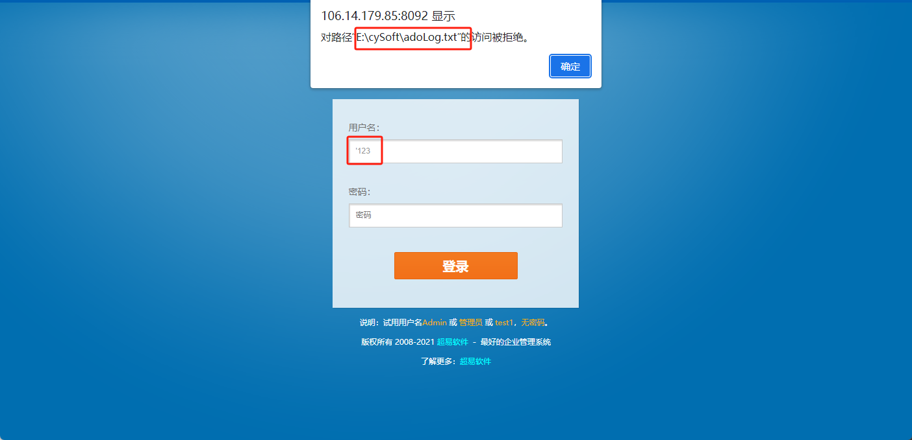

超易企业管理系统 信息泄露漏洞

Super easy enterprise management system information leakage vulnerability

Information leakage vulnerability of super easy enterprise management system; The server absolute path can be leaked by entering a single quotation mark。

