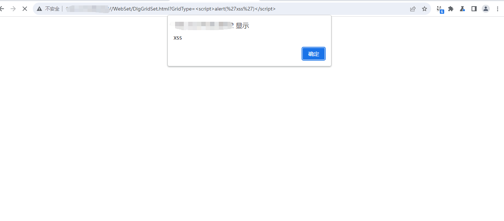

超易企业管理系统  XSS 

(Super easy enterprise management system XSS vulnerability)

官网：https://www.cysoft168.com/

There is XSS vulnerability in Super easy enterprise management system. XSS is a web application security vulnerability attack that is a type of code injection. It allows malicious users to inject code into a web page, which can affect other users when they view the page. Such attacks often involve HTML and client-side scripting languages. 

The vulnerability path is：

```
/WebSet/DlgGridSet.html?GridType=<script>alert(%27xss%27)</script>
```




