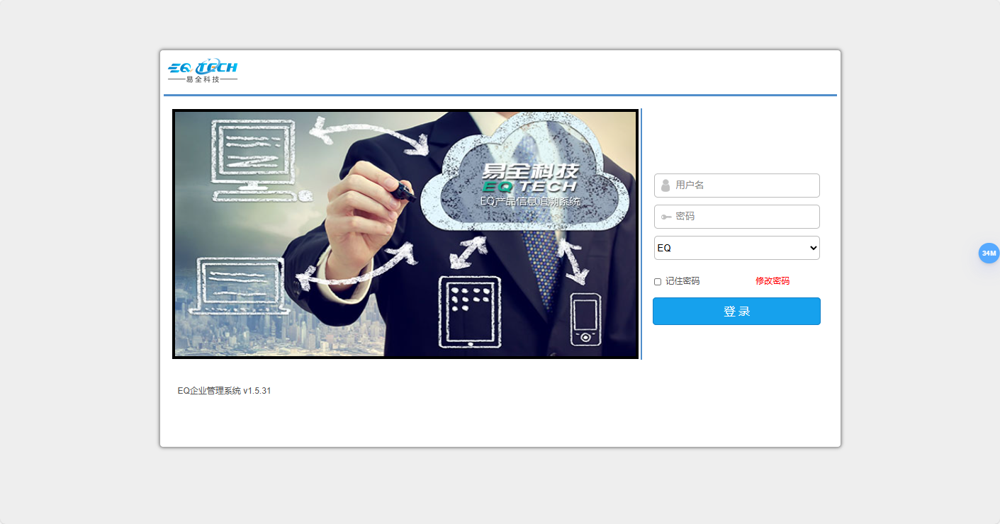
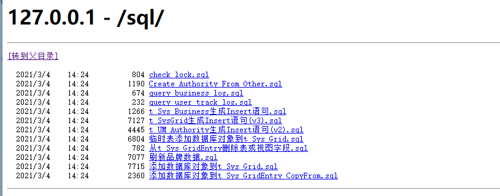
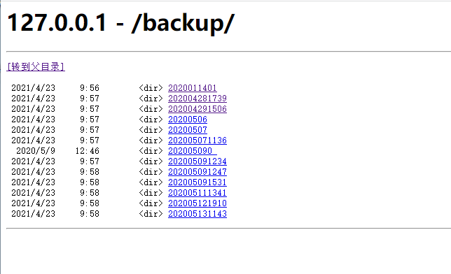

**Analysis and Remediation Suggestions for Directory Traversal Vulnerability in Guangzhou Yiquan Information Technology Co., Ltd. EQ Enterprise Management System**

**version** < v 2.0.0

广州易全信息科技有限公司  https://www.gzequan.com/

**Background:** Guangzhou Yiquan Information Technology Co., Ltd. (abbreviated as Yiquan Information) is a high-tech company specializing in enterprise management systems. The EQ Enterprise Management System is widely used in various enterprises for management and operations. However, a directory traversal vulnerability has recently been discovered in this system.

**Vulnerability Description:** This vulnerability allows attackers to access and download unauthorized files or directories on the server by crafting malicious requests. Such vulnerabilities typically occur when the application fails to properly validate and filter user-inputted paths. By exploiting directory traversal vulnerabilities, attackers can access system files, configuration files, and sensitive data, potentially leading to data breaches and system compromise.

**Impact of the Vulnerability:**

1. **Data Breach**: Attackers can access and download sensitive files on the server, such as configuration files and user data, leading to data breaches.
2. **System Compromise**: Access to system files may allow attackers to modify or delete critical files, causing system malfunctions or business disruptions.
3. **Privilege Escalation**: Attackers may use the information obtained from the files to further attack and escalate system privileges or perform malicious actions.
4. **Compliance Risks**: Data breaches and system disruptions may violate data protection regulations, resulting in legal liabilities and reputational damage.

## POC：



```
http://127.0.0.1:9000/sql/
```




```
http://127.0.0.1:9000/backup/
```



**Remediation Suggestions:**

1. **Input Validation and Filtering**: Implement strict validation and filtering of user-inputted paths to prevent unauthorized access to sensitive files.
2. **Path Normalization**: Ensure that the application correctly handles and normalizes path inputs to prevent directory traversal attacks.
3. **Access Controls**: Restrict user access to the file system, allowing access only to necessary files and directories.
4. **Security Audits**: Conduct regular code audits and vulnerability scans to identify and fix potential security issues promptly.

**Conclusion:** The EQ Enterprise Management System by Guangzhou Yiquan Information Technology Co., Ltd. plays a crucial role in enterprise management. Promptly addressing and fixing the directory traversal vulnerability will effectively protect the system's security and data integrity, mitigating potential security threats and compliance risks.
