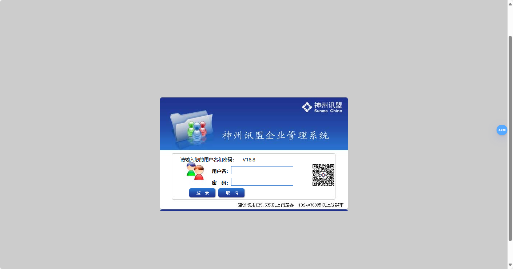
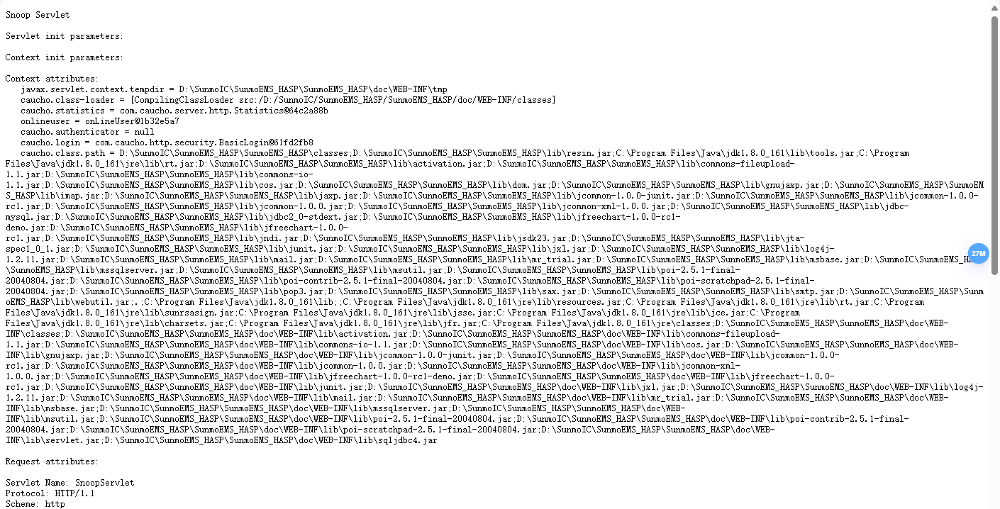

## Shenzhou news Union enterprise management system

`/servlet/SnoopServlet` is a URL path that can lead to the exposure of sensitive information. `SnoopServlet` is a servlet that may be present by default in certain web containers or application servers, and it can reveal a lot of details about the server environment, request information, and configurations.

Version：V5.0 -- V18.8

http://www.sunmochina.com/

### Causes of the Issue:

- **Default Configuration Not Disabled:** In some older versions of Java EE containers (such as Apache Tomcat), `SnoopServlet` might be enabled by default. If it is not explicitly disabled, attackers could access this URL to gather sensitive information.
- **Information Disclosure:** Accessing `/servlet/SnoopServlet` may return server environment variables, HTTP request headers, session information, JSP parameters, and other details that could be exploited by malicious actors, leading to security issues.



```
/servlet/SnoopServlet
```



### Solutions:

1. **Disable SnoopServlet:** Check the web application’s configuration file (such as `web.xml`) to ensure that `SnoopServlet` is not enabled. If it is enabled, disable or remove it.
2. **Apply Updates and Patches:** Ensure that the application server is up to date with the latest security patches.
3. **Access Control:** Implement strict access control on the web server's configuration to restrict access to paths like `/servlet/*`.
4. **Log Auditing:** Review access logs to determine if there have been any external attempts to access `/servlet/SnoopServlet` and assess the risk of data leakage.
